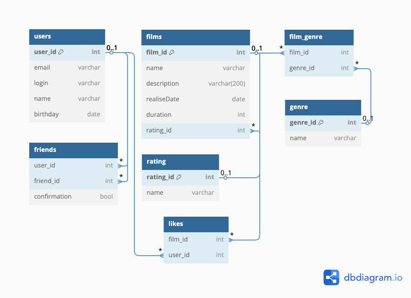

# java-filmorate
Template repository for Filmorate project.

### **База данных filmorate**<br>  



### **Таблица users**<br>
Содержит информацию о пользователях.   
Таблица включает поля:
* первичный ключ **id** — идентификатор пользователя;  
* **email** - электронная почта пользователя;  
* **login** - логин пользователя;  
* **name** - имя пользователя;  
* **birthday** - день рождения пользователя.    

### **Таблица friends**<br>
Содержит информацию о друзьях пользователей.  
Таблица включает поля:
* внешний ключ **user_id** (ссылается на таблицу **users**) - идентификатор пользователя;  
* внешний ключ **friend_id** (ссылается на таблицу **users**) - идентификатор друга пользователя.

### **Таблица films**<br>
Содержит информацию о фильмах.  
Таблица включает поля:
* первичный ключ **id** — идентификатор фильма;  
* **name** - название фильма;  
* **description** - описание фильма;  
* **releaseDate** - дата выхода фильма;  
* **duration** - продолжительность фильма в минутах;  
* внешний ключ **MPA_id** (ссылается на таблицу **MPA**) - рейтинг Ассоциации кинокомпаний. Эта оценка определяет возрастное ограничение для фильма.    

### **Таблица MPA**<br>
Содержит информацию об оценках, определяющих возрастное ограничение для фильма.  
Таблица включает поля:
* первичный ключ **id** - идентификатор рейтинга;  
* **name** - название рейтинга.    

### **Таблица genres**<br>
Содержит информацию о жанрах.  
Таблица включает поля:
* первичный ключ **id** - идентификатор жанра;  
* **name** - название жанра.    

### **Таблица film_genre**<br>
Содержит информацию о фильмах и их жанрах.  
Таблица включает поля:
* первичный ключ **id** — идентификатор;
* внешний ключ **film_id** (ссылается на таблицу **films**) - идентификатор фильма;  
* внешний ключ **genre_id** (ссылается на таблицу **genre**) - идентификатор жанра.    

### **Таблица likes**<br>
Содержит информацию о лайках.  
Таблица включает поля:
* первичный ключ **id** — идентификатор;
* внешний ключ **film_id** (ссылается на таблицу **films**) - идентификатор фильма;  
* внешний ключ **user_id** (ссылается на таблицу **users**) - идентификатор пользователя.


### Примеры запросов
#### Вывод количества общих друзей пользователей с id 1 и id 2:  

```
SELECT COUNT(f1.friend_id)
FROM friends AS f1
JOIN friends AS f2 ON f1.friend_id = f2.friend_id
WHERE f1.confirmation = 'true' 
AND f2.confirmation = 'true' 
AND  f1.user_id = 1 
AND f2.user_id = 2;
```


#### Вывод 10 самых популярных фильмов  

```
SELECT films.name,
       COUNT(films.id)
FROM likes
JOIN films ON likes.film_id = films.id
GROUP BY likes.film_id
ORDER BY COUNT(likes.film_id) DESC
LIMIT 10;
```


